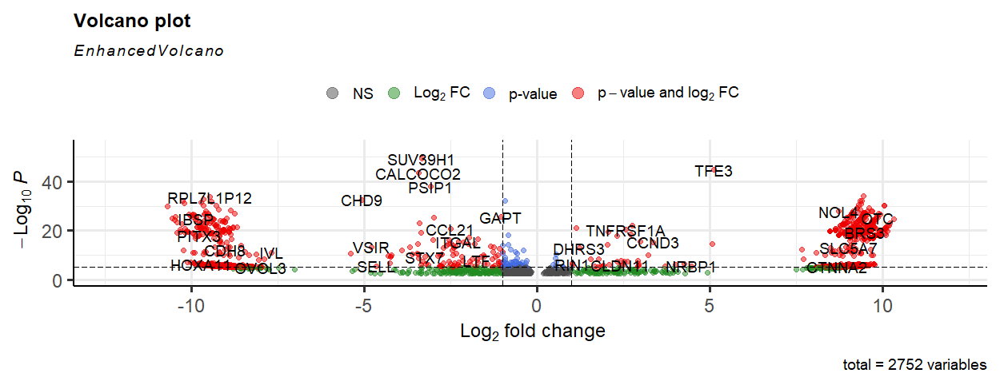
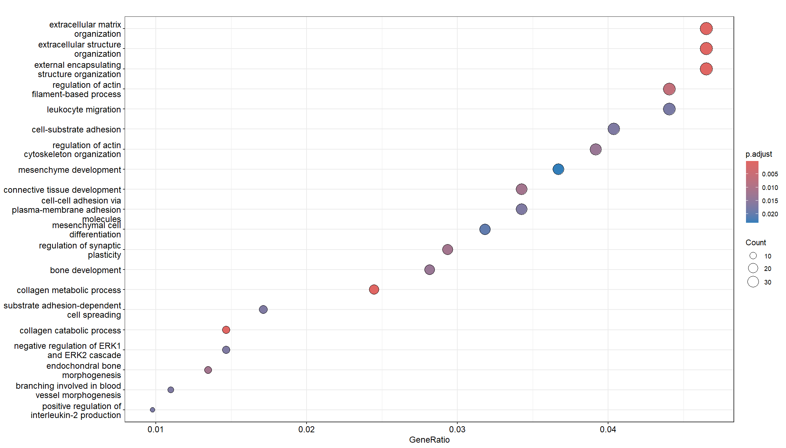

# Differential Expression Analysis Using DESEQ2

## Background & Motivation

Papillary thyroid carcinoma (PTC) is the most common type of thyroid cancer. This analysis was performed to identify differentially expressed genes in papillary thyroid carcinoma (PTC). The original study explores the role of Biglycan (BGN) in progression of PTC. The study highlights overexpression of BGN is associated with poor clinicopathological features of PTC. However, the transcriptomic landscape of PTC extends far beyond a single gene. This analysis explores the differential gene expression profiles & biological pathways disrupted in PTC pathogenesis that the original study didn't explore. 

## Dataset

For DEG analysis, RNA-Seq data (raw FASTQ reads) was downloaded from NCBI GEO with accession [GSE224356](https://www.ncbi.nlm.nih.gov/geo/query/acc.cgi?acc=GSE224356). The dataset consisted of 6 samples; 3 PTC tissue and 3 matched paired normal tissue.

## Objective

1. Identify and characterize differentially expressed genes between PTC and paired normal tissue.
2. Identify gene expression alterations associated with PTC pathogenesis beyond original study's BGN-centric focus.
3. Identify potential diagnostic and therapeutic biomarkers in the selected dataset.
4. Identify enriched biological pathways to determine the functional consequences of DEGs.

**Why DEG analysis instead of BGN-focused analysis?**

The original study characterised BGN as a driver of PTC progression but did not perform genome-wide pathway analysis. BGN alone cannot account for the complexity of PTC pathogenesis. This re-analysis asks: what is the full transcriptomic disruption in this dataset, and are there additional biomarker candidates beyond what the original study reported?

## Analysis Workflow

1.  **Data Import**

-   Raw FASTQ reads were obtained for all samples

2.  **Quality Check**

-   Tool: `fastqc`
-   Quality of raw reads was checked.

3.  **Quality Control**

-   Tool: `fastp`
-   All-in-one pre-processing was performed, including adapter trimming and removal of low quality bases.

4.  **Alignment**

-   Tool: `HISAT2`
-   The pre-processed reads were aligned with reference genome (hg38) using default parameters and BAM files were obtained.
-   **Why `HISAT2` instead of STAR:** `HISAT2` is a splice aware aligner, meaning it can correctly map the reads at exon-intron boundries. This ensures accurate mapping of transcript-derived reads against the reference genome. `HISAT2` is less computationally heavy than STAR. 

5.  **Transcript Quantification**

-   Tool: `featurecounts`
-   The aligned reads were assembled into transcripts and quantified. The final counts matrix was used to perform DE analysis.

6.  **DE Analysis**

-   Tool: `DESEQ2`
-   Counts matrix was imported into RStudio, `DESeqDataSet` object was created, low count genes were removed and final DE analysis was done. The DE genes (padj \< 0.05 and \|log2FC\| ≥ 1) lists were obtained and upregulated and downregulated genes were identified.
-   **Why `DESEQ2`:** With only 3 samples per group, `DESeq2` is ideal because it uses a statistical method called empirical Bayes shrinkage to accurately estimate variation in small datasets. While other tools like `edgeR` or `limma-voom` need more samples to give reliable results, `DESeq2` shares data across thousands of genes to keep variance estimation stable even with minimal replicates.

7. **Pathway Enrichment Analysis**

-   Tool: `clusterProfiler`
-   Performed Over-Representation Analysis (ORA) targeting Gene Ontology (GO) Biological Processes to determine the functional roles of the isolated DEGs.

8.  **Visualization**

-   Tools: `MA Plot`, `Volcano Plot`, `Dot Plot`.
-   MA and enhanced volcano plots were used to view DE genes.
-   Dot plot was used to visualize enriched biological pathways


## Results

A total of 2752 genes were known to be DE. Among these, 1466 genes were upregulated and 903 genes were downregulated. Many of these DE genes are known to be involved in pathogenesis of PTC and act as biomarkers of the disease. Some of these known PTC-associated genes include S100A6, COL1A1, DHRS3, COL3A1, ZAP70, TIMP1, and SERPINA1. These genes contribute towards PTC and are known to be diagnostic and therapeutic biomarkers of the disease.
 

Enrichment plot shows that extracellular matrix organization & leukocyte migration are the most enriched pathways. ECM disruption is a hallmark of tumour metastasis. Degradation and remodelling of the extracellular matrix enables tumour cells to breach tissue boundaries and invade surrounding structures. Its dominance here is consistent with PTC's known propensity for lymph node invasion and local spread. The concurrent enrichment of leukocyte migration pathways suggests active remodelling of the tumour immune microenvironment, which may reflect either immune cell recruitment or, conversely, mechanisms of immune evasion.

## Getting Started 

To run this pipeline locally, open your terminal, clone the repository, and navigate into the project directory:

```bash
git clone https://github.com/razmia02/Differential_Expression_Analysis_PTC.git)
cd Differential_Expression_Analysis_PTC
```

### Environment Setup

This project uses renv to manage R package dependencies. You do not need to install packages manually.

1. Open the project in RStudio (open `DE_analysis_PTC_GSE224356.Rproj` if available, or set your working directory to this folder).

2. Run the following command in your R console to automatically install all packages specified in the renv.lock file:

```
renv::restore()
```

### Run the Analysis

Once your environment is restored, ensure your count data is placed in the `counts/`directory, then run the differential expression analysis:

```
# Run the script via terminal

Rscript DESEQ2_analysis.R
```

All outputs, including significantly differentially expressed genes and the final volcano plot, will be saved automatically into the `Results/` directory.

## Repository Structure
```
DE_Analysis/
├── DESEQ2_analysis.R/                      # R script for DESEQ2 analysis
├── counts/
│   ├── counts.csv     # Counts in CSV format
│   ├── counts.tabular    # counts in tab format
│   └── counts.txt        # counts in txt format
├── Results/
│   ├── VolcanoPlot.png               # Volcano plot showing significantly DE genes
│   └── DE_genes.csv               # Significant DE genes in csv 
└── README.md                  # Project documentation
```

## References
-  [Enhancer-mediated NR2F2 recruitment activates BGN to promote tumor growth and shape tumor microenvironment in papillary thyroid cancer](https://pmc.ncbi.nlm.nih.gov/articles/PMC12665125/)
-  [Identification of Differentially Expressed Genes in Papillary Thyroid Cancers](https://pmc.ncbi.nlm.nih.gov/articles/PMC2649849/)
-  [Identification of Biomarkers Based on Differentially Expressed Genes in Papillary Thyroid Carcinoma](https://www.nature.com/articles/s41598-018-28299-9)
-  [Network Analyses of Integrated Differentially Expressed Genes in Papillary Thyroid Carcinoma to Identify Characteristic Genes](https://www.mdpi.com/2073-4425/10/1/45)
